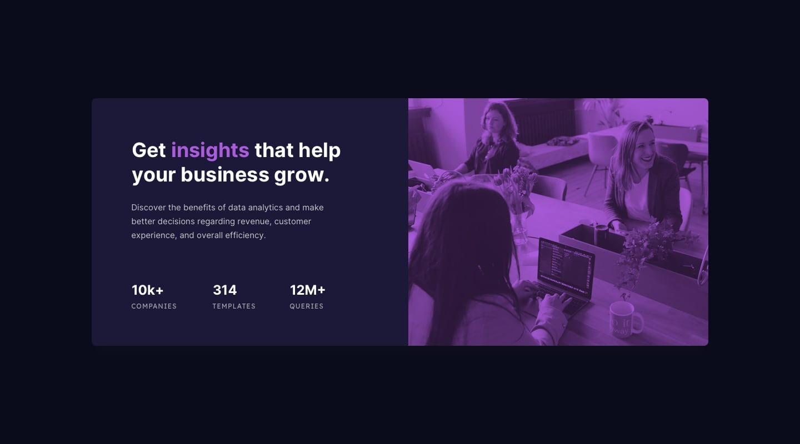

# Silvio Arraiz - statuscardProyects_

## Welcome! 👋

## Welcome! 👋

Thanks for checking out my front-end coding challenge.

This project was made using only html and css.

## The challenge

My challenge was to build out this card component and get it looking as close to the design as possible.

Users should be able to:

- View the optimal layout depending on their device's screen size

## How to clone the project

To clone the project, you just have to download the files to your computer and start it locally, no special requirement is needed.

## Where to find the files

Feel free to use any workflow that you feel comfortable with. Below is a suggested process, but do not feel like you need to follow these steps:

1. You can find the files publicly in the following address [have a read-through of this Try Git resource](https://github.com/sarraiz/statuscardProyects_).

## Got feedback for us?

I love getting feedback! I'm always looking to improve the challenges and the platform. So if you have something you'd like to mention, please email hello [at] silvio.arraiz [dot] gmail.

This challenge is completely free. Share it with anyone who finds it useful for practice.
